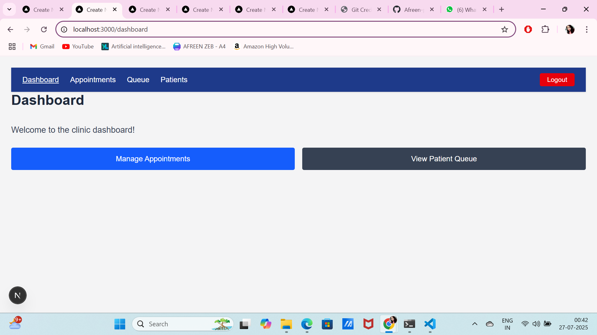
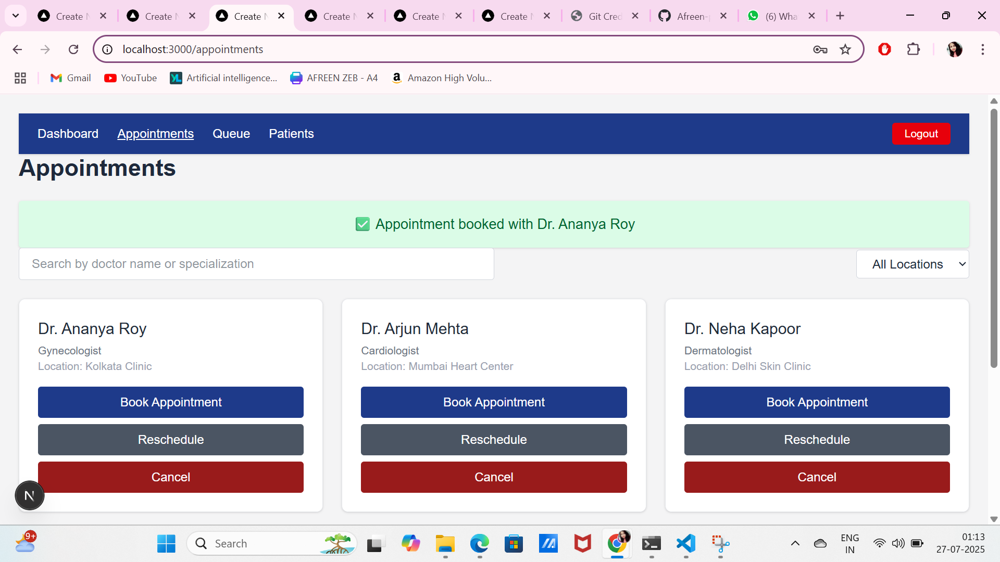
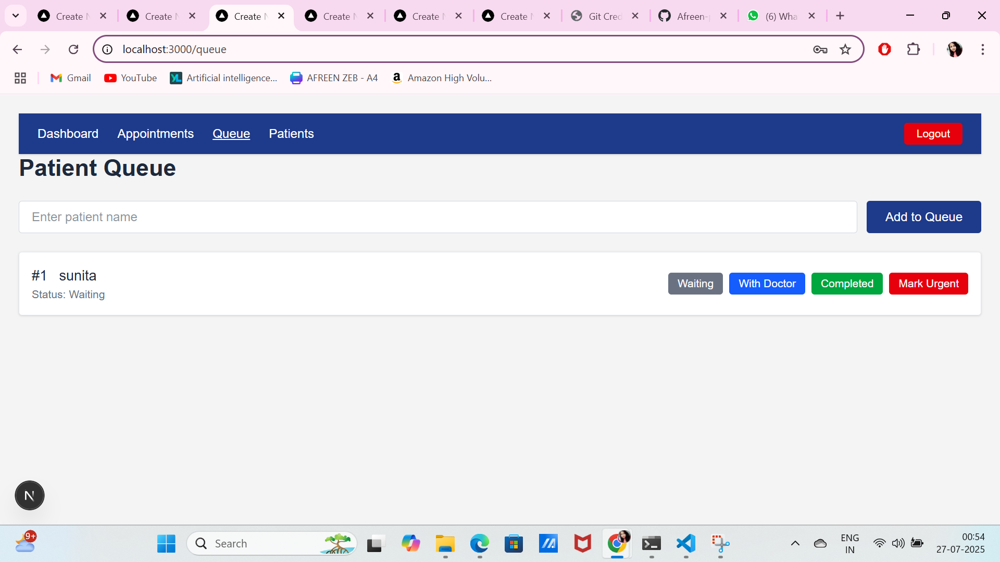

# Front Desk Clinic Management System

This is a modern front desk system built using **Next.js**, designed for clinics to manage appointments, patient queues, and doctor schedules efficiently.

---

## 🌟 Features

- 📅 Book, reschedule, and cancel appointments
- 🧑‍⚕️ View and manage doctor listings
- 🧑‍💼 Maintain a dynamic patient queue
- 🧾 Collect and store patient details
- 🔐 Login system with session management
- 🎨 Clean, responsive UI with Tailwind CSS

---
## Login Page


## Dashboard Page


## Appointments page

## Queue page


## 📸 Screenshots

### Dashboard


### Appointments


### Patient Queue


### Patient Details


---

## 🎥 Demo Video

[▶️ Watch Front Desk Demo](public/screenshots/Front_Desk.mp4)

---

## 🚀 Tech Stack

- **Framework:** Next.js 15 (App Router, TypeScript)
- **Styling:** Tailwind CSS
- **Backend/Data:** Local Storage (for demo), MySQL (optional)
- **Version Control:** Git & GitHub

---

## 📦 Installation (For Developers)

```bash
git clone https://github.com/Afreen-p-c/front-desk-frontend.git
cd front-desk-frontend
npm install
npm run dev
